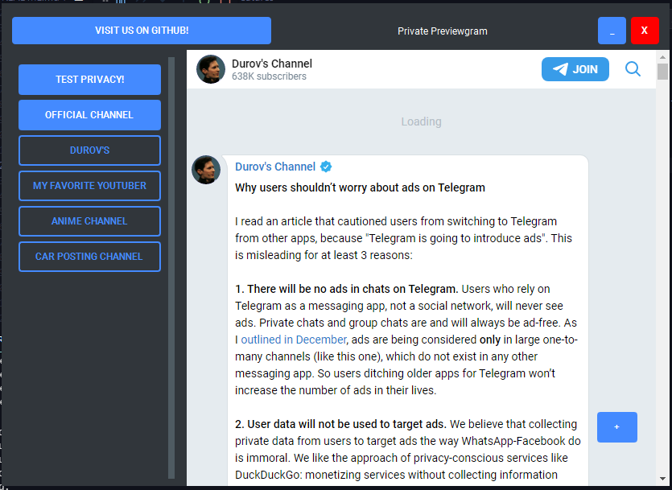
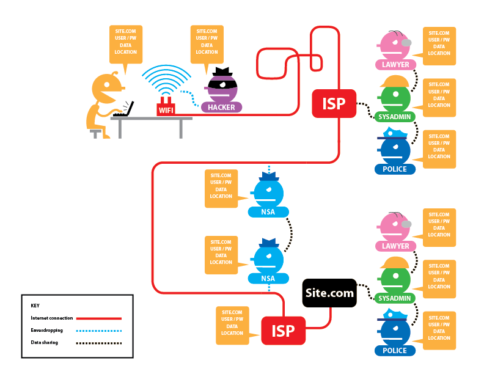
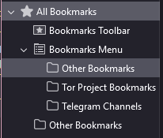
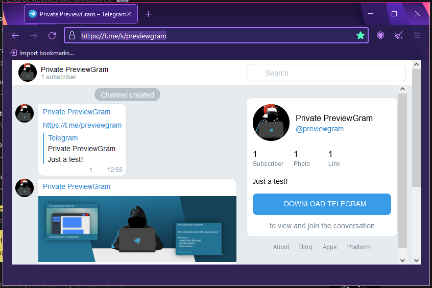

<h1 align="center">Private PreviewGram</h1>

<h2 align="center">Run away from Metadata</h2>

<div align="center">
  <a href="https://t.me/previewgram" align="center">
    
  </a>
</div>

---

<div align="center">
  <a href="https://rickbarretto.github.io/PreviewGram/docs/docs">Docs</a>|
  <a href="#how-to-install">Installing</a>|
  <a href="https://github.com/RickBarretto/PreviewGram/issues">Issues</a>|
  <a href="https://github.com/RickBarretto/PreviewGram/discussions">
    Discussions!
  </a>
</div>

---

> \[⚠️\] - Warning:
> <br>
> USE A **VPN** TO HIDE YOUR IP
> **IT'S IN TEST**

> PreviewGram is under LGPL License
> <br>
> Application's theme from [UN-GCPDS/qt-material](https://github.com/UN-GCPDS/qt-material)
> under [BSD-2-Clause License](https://github.com/UN-GCPDS/qt-material/blob/master/LICENSE).

> **Please, Read [For Devs](#for-devs)**

## Why use

**PreviewGram is for users that wants get a more private experience** with the
Telegram's Channel. It's because:

-  Telegram collects when you see determinate content
-  Groups show publicly who are the followers*
-  The channel owners can see who are them followers
-  Telegram added Group Read Receipts*
-  You must to trust on Telegram's Servers

> - **\* PreviewGram doesn't protects you against it, because can't view Group
> Chats.**

> \[⚠️\] - Warning
> <br>
> If you don't enabled Github's JavaScript, go to [`Telegram Privacy Issues`](#telegram-privacy-issues)
> Topic to understand
> more.

## How to install

```bash
> pip install -r requirements.txt
> py -m build
> pip install dist/Private\ PreviewGram-1.1.tar.gz
```

> \[⚠️\] - Note
> If you're in another version, change the ``1.1`` for the current version.

Or [Download Last Release](https://github.com/RickBarretto/PreviewGram/releases/)


### Running without install

- Clone this project

```bash
> git clone https://github.com/RickBarretto/PreviewGram.git
```

- Or [Download Source Code](https://github.com/RickBarretto/PreviewGram/archive/refs/heads/main.zip)

- On repository folder, run:

```bash
> pip -m test_application.py
```

## Running Application

Just type:

```bash
> ppg
```

## Features



PreviewGram protects you when:

- Disables JavaScript when Browsing
  - Doesn't store cookies
  - Doesn't run trackers
- Uses a generic Chrome user-agent
- Doesn't use Telegram's API
- Doesn't require a Account

Useful Features:

- Store locally your favorites Channels
- Can't open some links

## Limitations

PreviewGram isn't the perfection on Earth. Because:

1. Doesn't use JavaScript
2. It's limited by the Telegram's Preview Site itself.

So, PreviewGram can't:

- Hide your IP*
- Play videos**
- See Group Chats***
- Download files directly*** (instead this, do:
`RMB**** > Copy link address` and download on Telegram App)

> - \* Use a VPN or Proxy. Read [`Why PreviewGram doesn't use Tor's Proxy by itself?`](#why-previewgram-doesnt-use-tors-proxy-by-itself)
> - \*\* Because JavaScript is disabled
> - \*\*\* Preview website limitation
> - \*\*\*\* RMB is Right Mouse Button

## Tips

- Always use Vpn or Proxy
- To open links, do `RMB* > Copy link address`
- If you want to watch videos,
please use Tor** (or any Browser that you trust)
- Click on `Test privacy!` button to test for yourself. It's tested by [What Is My Browser](https://www.whatismybrowser.com/)
\*\*\*

> - \* RMB is Right Mouse Button
> - \*\* Read [`Accessing via Tor`](#accessing-via-tor)
> - \*\*\* [What Is My Browser's Privacy Policy](https://www.whatismybrowser.com/about/legal/)

> **Extra:** Accessing channels through TorBrowser
> <br>
> Go to [``Accessing via Tor``](#accessing-via-tor) topic.

---

## For Devs

> Fork it and contribute!

- Build instructions at [`How to install`](#how-to-install)
- Documentation at [Docs]("https://rickbarretto.github.io/PreviewGram/docs/docs/index.html")

### Realtime Docs

```bash
> pip install -r requirements.txt
> pdoc ./src
```

---

## VPN, Proxy and Tor

### Differences

#### Proxy

> Proxy is your online ID, hiding you real IP Address.
> It's a intermediary between your Web Browser and the internet,
> a web site for example. (Needs to be configured per-app basis)

#### VPN

> VPN covers 100% of you device traffic, encrypting the connection.
> It'll hide your real IP Address.

#### The Onion Route (Tor)

> Tor anonymizes your traffic sending it through a series of proxies,
> this proxies are called Nodes, that encrypts the traffic and
> sends to destiny using a Exit Node.


#### Sources:

> - [Should I Use a VPN, Proxy, or Tor? - AVG](https://www.avg.com/en/signal/vpn-vs-proxy-vs-tor)
> - [Penetration testing: TOR, VPN or proxy - InfoSec](https://resources.infosecinstitute.com/topic/penetration-testing-tor-vpn-or-proxy/)
> - [What is the difference between a proxy and a VPN? - ProtonVPN](https://protonvpn.com/blog/proxy-vs-vpn/)
> - [About Tor - Tor Project](https://support.torproject.org/about/)

### The Tor's Power

<!-- ✏️ToDo: Change table to a single image -->
#### With and Without Tor:
|Tor: off / Https: off|Tor: off / Https: on|Tor: on / Https: on|
|---------|---------|---------|
|[](./assets/Tor/tor-https-0.png)| [](./assets/Tor/tor-https-1.png) |[](./assets/Tor/tor-https-3.png)|

> Source: [When I'm using Tor, can eavesdroppers still see the information I share with websites, like login information and things I type into forms?](https://support.torproject.org/https/https-1/ )

### Why PreviewGram doesn't use Tor's Proxy by itself

Tor have some issues, and
isn't recommended to use Tor outside TorBrowser to avoid DNS Leaks and
VPN+TOR issues.

#### Sources:

> - [Bittorrent over Tor isn't a good idea - Tor Project](https://blog.torproject.org/bittorrent-over-tor-isnt-good-idea/)
> - ["Tor Browser will block browser plugins such as Flash, RealPlayer, QuickTime, and others: they can be manipulated into revealing your IP address." - Tor Project](https://www.torproject.org/download/#Warning)
> - [KNOWN ISSUES - Tor Project](https://tb-manual.torproject.org/known-issues/)
> - [TorPlusVPN - Tor Project (GitLab)](https://gitlab.torproject.org/legacy/trac/-/wikis/doc/TorPlusVPN)
> - [Brave browser leaks onion addresses in DNS traffic - ZDNet](https://www.zdnet.com/article/brave-browser-leaks-onion-addresses-in-dns-traffic/)

### But What The F😡😡😡 talking about Tor, if PreviewGram doesn't use it???

> Because you can Access the channels via Tor
> <br>
> Yep, you don't need this application if you have Tor... 🙃

#### Accessing via Tor

1. Create a "Telegram Channels" Folder on Bookmarks
  1. 
1. To access your favorite channel, put a ``/s/`` between the domain and
channel name,
example: `https://t.me/previewgram` to `https://t.me/s/previewgram`
1. Save to "Telegram Channels"'s Bookmark Folder
  1. 
1. Access when you want!
1. **Extra:** make [Tor portable](https://tb-manual.torproject.org/make-tor-portable/)
and use the [Mobile Tor Browser](https://tb-manual.torproject.org/mobile-tor/)
to use everywhere.

#### Sources:

> - [MAKE TOR BROWSER PORTABLE - Tor Project](https://tb-manual.torproject.org/make-tor-portable/)
> - [MOBILE TOR - Tor Project](https://tb-manual.torproject.org/mobile-tor/)

## Help PreviewGram

If you're a Dev (or not), help PreviewGram forking and making pull requests.
Don't afraid to use the Github's Issue Tab to make critics,
suggestions, bugs and security reports! 😉

---

## To Do

- [ ] Block ``telegram.org`` and
other https requests using
`webView.page().profile().setUrlRequestInterceptor(interceptor)`
(Thanks, dbunk!)
- [ ] Channel Categories
- [ ] Open on Tor
- [ ] UI improvements?

---

## Telegram Privacy Issues

- According to VPN Mentor,
Telegram "Telegram is Not as Private as it Claims" saying
that they "operates with zero transparency":
  - Source: [Cybercrime on Telegram: How Hackers Are Using the Messaging App to Share Data Leaks and Hacks - VPN Mentor](https://www.vpnmentor.com/blog/cybercrime-on-telegram/)
- Telegram can suffer Law Enforcement
  - [Telegram agreed to transfer to the special services \[but not Russian\] IP-addresses and numbers of some users](https://sudonull.com/post/11959-Telegram-agreed-to-transfer-to-the-special-services-but-not-Russian-IP-addresses-and-numbers-of-some)
  - [Law Enforcement Authorities](https://telegram.org/privacy#8-3-law-enforcement-authorities)
- In 2020, Telegram suffered a data leak:
  - Source: [Millions of Telegram Users’ Data Exposed on Darknet - CoinTelegraph](https://cointelegraph.com/news/millions-of-telegram-userss-data-exposed-on-darknet)
  - It isn't a Telegram specific problem.
Read [`Osint Problems`](#osint-problems), because: “Unfortunately,
any contacts-based app faces the challenge of
malicious users trying to upload many phone numbers and
build databases that match them with user IDs – like this one.”
\- Telegram representative to CoinTelegraph
  - **Tip:** hide your phone number on Telegram's configurations.
- Telegram added Group Read Receipts:
  - Source: [Read Receipts in Small Groups - Telegram](https://telegram.org/blog/chat-themes-interactive-emoji-read-receipts#read-receipts-in-small-groups)

> As any Social Network app, Telegram suffers with
[Osint](#osint-problems) (Open-Source Intelligence),
be caution with the information that you exposes publicly about yourself!

## Osint Problems

### What is Osint

Yeah, it's the information era, 500 millions tweets are published every day.
Public information like birthday, complete name,
age are available on internet published by its own users.
Which in itself poses privacy risks.

> "Open-source intelligence (OSINT) is a multi-factor
(qualitative, quantitative)
methodology for collecting, analyzing and
making decisions about data accessible in
publicly available sources to be used in an intelligence context."
> Source: [Open-Source Intelligence - Wikiless](https://wikiless.org/wiki/Open-source_intelligence?lang=en)

So, caution with your public information! 😉

Articles:

- [Hackers leak LinkedIn 700 million data scrape](https://therecord.media/hackers-leak-linkedin-700-million-data-scrape/)
- [Facebook attributes 533 million users' data leak to "scraping" not hacking](https://www.bleepingcomputer.com/news/security/facebook-attributes-533-million-users-data-leak-to-scraping-not-hacking/)

